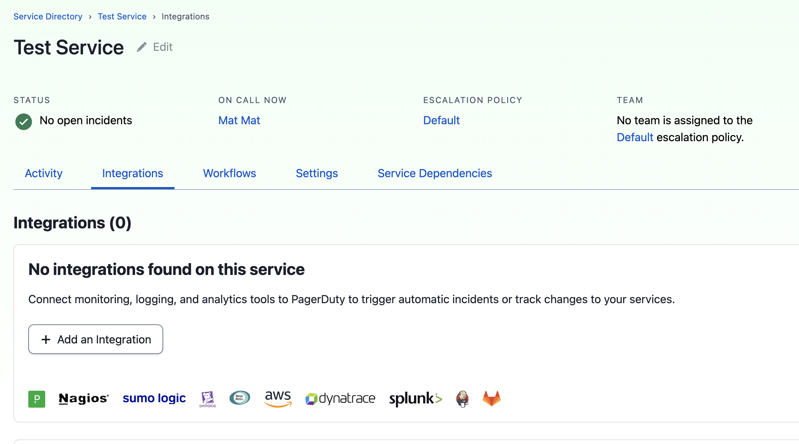
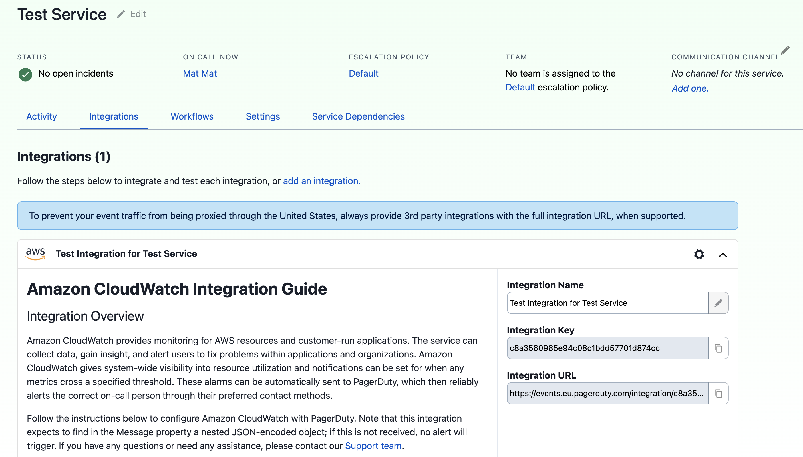

# Set up a new service with a third party integration

With the PagerDuty resources for CloudFormation, you can manage your services and corresponding integrations, 
in an efficient and consistent manner.

This demo will use the following types:

* `PagerDuty::Users::User` - to manage a PagerDuty user.
* `PagerDuty::EscalationPolicies::EscalationPolicy` - escalation policy is a requirement for creating a service.
* `PagerDuty::Services::Service` - a new service in PagerDuty to be created and managed with CloudFormation.
* `PagerDuty::Services::Integration` - to create a new integration that will be attached to the service.

See the [full CloudFormation template](example.yaml) for an overview of the stack.

## Configure a user

In order to create an Escalation Policy, it requires at least one escalation rule with at least one target.
In this example we create a new user who is set to be the target of the Escalation Policy created later.

```yaml
Resources:
   # 1. User
   JamesUser:
      Type: PagerDuty::Users::User
      Properties:
         Name: James Rodes
         Email: james-rodes@acme.com
         TimeZone: Europe/London
         Color: blue
         Role: admin
         JobTitle: Lead Engineer
```

## Defining an escalation policy

Now that we have our user, it's time to define how alerts are going to be escalated. In this example and in an
alert is raised, we create an Escalation Policy with the target of the lead engineer, in this case James Rodes, 
after 30 minutes if no acknowledgement. This policy can repeat at most 2 times.

```yaml
  # 2. Escalation Policy
  EscalationPolicy:
     Type: PagerDuty::EscalationPolicies::EscalationPolicy
     Properties:
        Name: "Engineering Escalation Policy"
        Description: "Escalation policy for the engineering team."
        NumLoops: 2
        OnCallHandoffNotifications: "if_has_services"
        EscalationRules:
           - EscalationDelayInMinutes: 30
             Targets:
                - Id: !Ref JamesUser
                  Type: "user_reference"
```

## Defining a Service

With the Escalation Policy in place, we are now able to create a Service. 
In order to create a service, it is sufficient to provide the `Name` and `EscalationPolicyId` parameters,
but additionally user is able to specify more parameters to configure alerts, support hours, scheduled actions, etc.

```yaml
  # 3. Service
  PagerDutyService:
    Type: PagerDuty::Services::Service
    Properties:
      Name: Test Service
      Description: Service Description
      AutoResolveTimeout: 14400
      AcknowledgementTimeout: 1800
      Status: active
      EscalationPolicyId: !GetAtt EscalationPolicy.Id
      IncidentUrgencyRule:
        Type: use_support_hours,
        DuringSupportHours:
          Type: constant
          Urgency: high
        OutsideSupportHours:
          Type: constant
          Urgency: low
      SupportHours:
        Type: fixed_time_per_day
        TimeZone: America/Lima
        StartTime: 09:00:00
        EndTime: 17:00:00
        DaysOfWeek: [ 1,2,3,4,5 ]
      ScheduledActions:
        - support_hours_start
      AlertCreation: create_alerts_and_incidents
      AlertGroupingParameters:
        Type: time
        Config:
          Timeout: 921
      AutoPauseNotificationsParameters:
        Enabled: true
        Timeout: 300
```

## Integration associated with the Service

With the Service created, we can now use the Integration resource to create a PagerDuty integration attached to the new Service.
In order to create the integration, we need to know the `Type` and the `VendorId`, which are available for popular providers,
such as AWS services, Datadog, or New Relic. For full suite of integrations please refer to: https://www.pagerduty.com/integrations/

For this example we will be using the integration for `AWS CloudWatch` which has a `Type` of `event_transformer_api_inbound_integration` 
and `VendrId` value: `PZQ6AUS`.
```yaml
  # 4. Integration
  PagerDutyIntegration:
    Type: PagerDuty::Services::Integration
    Properties:
      Name: Test Integration for Test Service
      Type: event_transformer_api_inbound_integration
      ServiceId: !GetAtt PagerDutyService.Id
      VendorId: PZQ6AUS
```

## Conclusion

As a result, we have created a new user in PagerDuty, as well as an EscalationPolicy targting that user.

With the Escalation Policy in place, we were able to create a new service using Cloudformation



With the service created, we can also use the Cloudformation resource to create a new integration for the service.
In this case we have created an integration with AWS Cloudwatch:



The integration can now be used within the new service and should users have further infrastructure in the Cloudformation template,
e.g. an SNS topic, they can use the `PagerDutyIntegration.IntegrationUrl` to automatically provide the integration URL to the SNS topic.