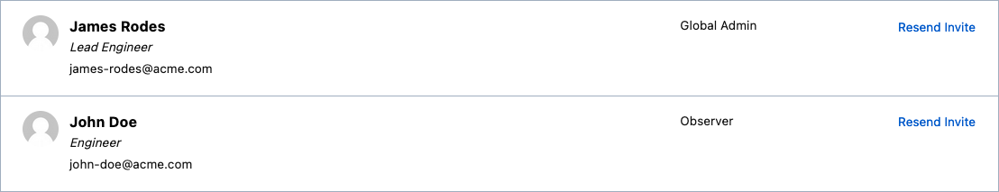
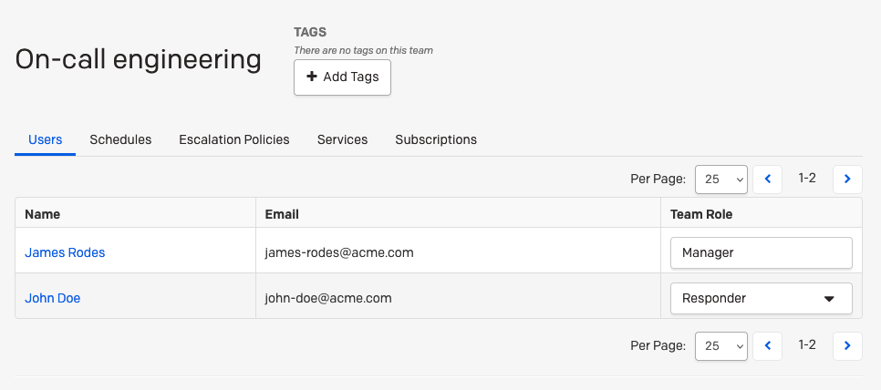
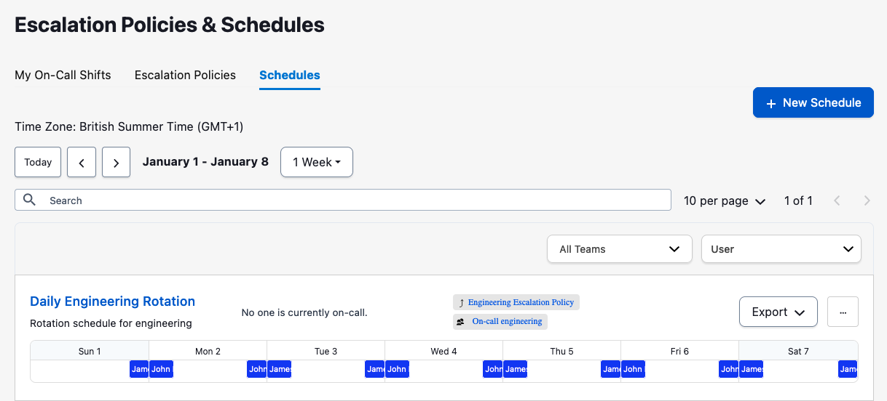
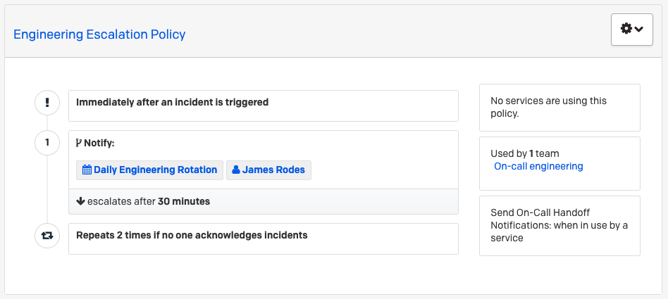
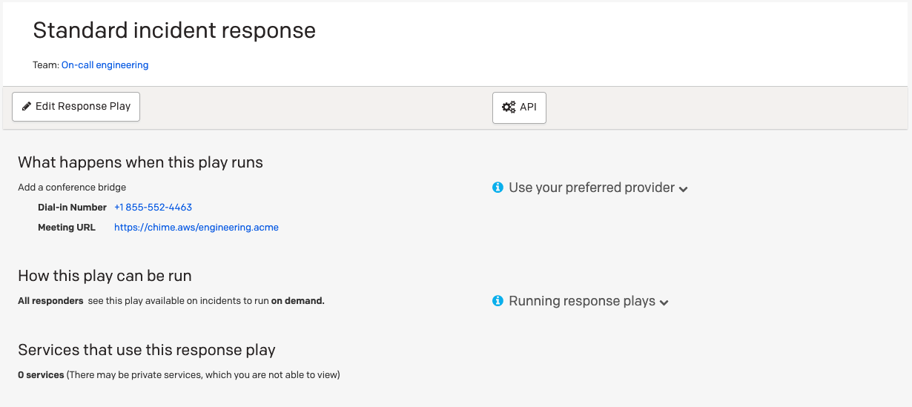

# Set up monitoring of new project

With the PagerDuty resources for CloudFormation, you can set up the monitoring and alerting of your application when
errors occur, in an efficient and consistent manner.

Project build pipelines and other project-bootstrap infrastructure can also be included
as part of the CloudFormation, so organizations can have a quick and common way to bootstrap a new project.

This demo will use the following types:

* `PagerDuty::Users::User` - to manage a PagerDuty user.
* `PagerDuty::Teams::Team` - to manage a PagerDuty team.
* `PagerDuty::Teams::Membership` - to manage membership of a PagerDuty team.
* `PagerDuty::EscalationPolicies::EscalationPolicy` - to manage an escalation policy in PagerDuty.
* `PagerDuty::Schedules::Schedule` - to define a schedule for PagerDuty users and teams.
* `PagerDuty::ResponsePlays::ResponsePlay` - to define a response play for users and teams.

See the [full CloudFormation template](example.yaml) for an overview of the stack.

## Stack parameters

The response play requires the email address of a value PagerDuty user associated to the account in order to be
created/updated. The example template requests this email address via a parameter `From` that is required:

```yaml
Parameters:
  From:
    Type: String
    Description: The email address of a valid user associated with the account making the request.
```

## Configure users and teams

In order to receive alerts, we need first to create recipients for these on PagerDuty. In this example, we have 2 users
who are the 2 engineers on-call. These engineers will be part of a PagerDuty team names `On-call engineering`.

```yaml
Resources:
  # 1. Users and team creation
  JohnUser:
    Type: PagerDuty::Users::User
    Properties:
      Name: John Doe
      Email: john-doe@acme.com
      TimeZone: Europe/Paris
      Color: blue
      Role: observer
      JobTitle: Engineer
  JamesUser:
    Type: PagerDuty::Users::User
    Properties:
      Name: James Rodes
      Email: james-rodes@acme.com
      TimeZone: Europe/London
      Color: blue
      Role: admin
      JobTitle: Lead Engineer
  OnCallTeam:
    Type: PagerDuty::Teams::Team
    Properties:
      Name: On-call engineering
      Description: Team that includes engineers for on-call issues
  JohnUserMembership:
    Type: PagerDuty::Teams::Membership
    Properties:
      TeamId: !Ref OnCallTeam
      UserId: !Ref JohnUser
      Role: responder
  JamesUserMembership:
    Type: PagerDuty::Teams::Membership
    Properties:
      TeamId: !Ref OnCallTeam
      UserId: !Ref JamesUser
      Role: manager
```

# Defining an on-call schedule

Now that we have our users and teams defined, it's time to configure our on-call schedule so the right people are alerted
at the right time.
For instance, we define a schedule for a night shift, starting at 8pm every day, where both engineers will rotate
on a 4 hours shift.

```yaml
  # 2. On-call schedule for the users
  EngineeringSchedule:
    Type: PagerDuty::Schedules::Schedule
    Properties:
      Name: "Daily Engineering Rotation"
      Description: "Rotation schedule for engineering"
      TimeZone: "Europe/London"
      ScheduleLayers:
        - Name: "Night Shift"
          Start: "2023-01-01T20:00:00+00:00"
          RotationVirtualStart: "2022-12-31T00:00:00+00:00"
          RotationTurnLengthSeconds: 86400 # 1 day
          Users:
            - User:
                Id: !Ref JohnUser
                Type: "user_reference"
            - User:
                Id: !Ref JamesUser
                Type: "user_reference"
          Restrictions:
            - Type: "daily_restriction"
              StartTimeOfDay: "20:00:00"
              DurationSeconds: 32400
```

## Defining an escalation policy and response play

Now that we have our users and schedule, it's tie to define how alerts are going to be escalated. In this example and in an
alert is raised, then we are going to escalate:
1. to the engineering schedule defined above.
2. to the lead engineer, in this case James Rodes, after 30 minutes if no acknowledgement
This policy can repeat at most 2 times.

Finally, a response play is also create to give standard tools and communication channels to all the responders.

```yaml
  # 3. Escalation policy & response play
  EscalationPolicy:
    Type: PagerDuty::EscalationPolicies::EscalationPolicy
    Properties:
      Name: "Engineering Escalation Policy"
      Description: "Escalation policy for the engineering team."
      NumLoops: 2
      OnCallHandoffNotifications: "if_has_services"
      EscalationRules:
        - EscalationDelayInMinutes: 30
          Targets:
            - Id: !Ref EngineeringSchedule
              Type: "schedule_reference"
            - Id: !Ref JamesUser
              Type: "user_reference"
      Teams:
        - Id: !Ref OnCallTeam
          Type: "team_reference"
  ResponsePlay:
    Type: PagerDuty::ResponsePlays::ResponsePlay
    Properties:
      From: !Ref From
      Name: "Standard incident response"
      Team:
        Id: !Ref OnCallTeam
        Type: "team_reference"
      ConferenceType: manual
      ConferenceUrl: https://chime.aws/engineering.acme
      ConferenceNumber: "+1 855-552-4463"
      Runnability: responders
```

## Conclusion

As a result, we now have a users and team on PagerDuty





We also have a schedule utilizing an escalation policy and the created team





We also have a standard response play

